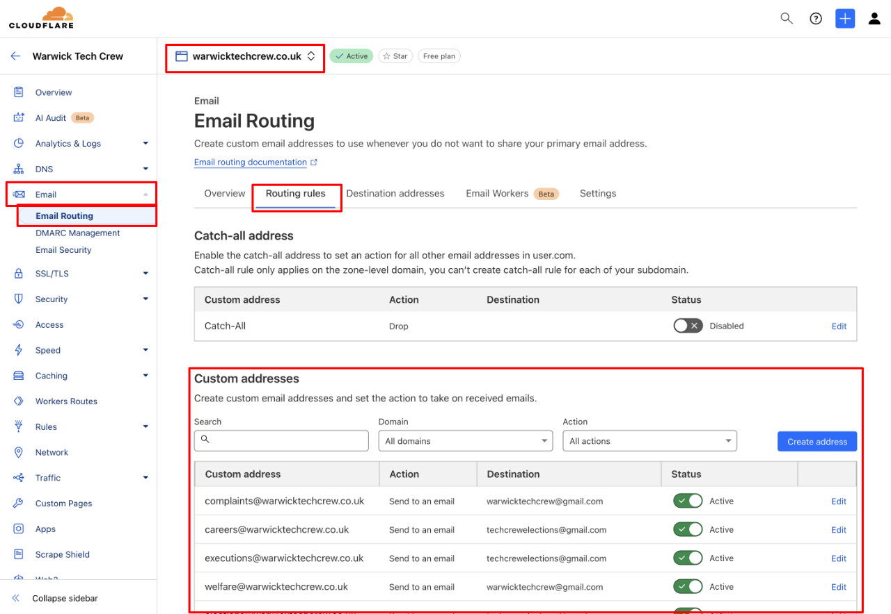
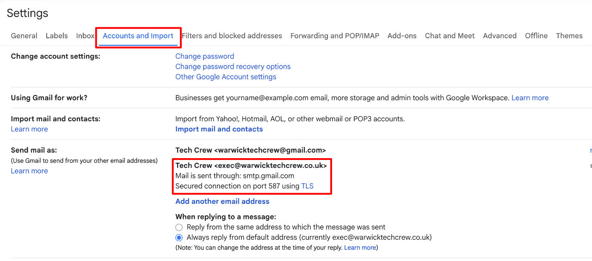
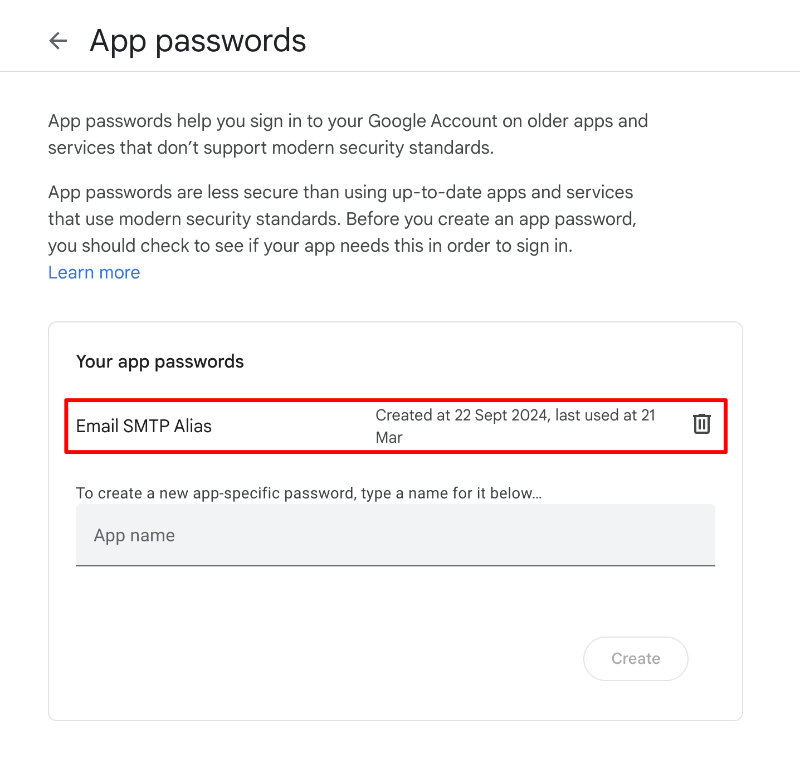

# Email Routing

This page covers how Tech Crew emails are routed to and from the [shared Gmail account](../01-gmail/index.md). This
is quite technical, but shouldn't need to be touched on a day-to-day basis.

## Inbound Emails

### `warwicktechcrew@gmail.com`

This is fairly straightforward - this is the email address of the shared Gmail account.

### `*@warwicktechcrew.co.uk`

These are routed using **Cloudflare Email Routing**. They can be configured in the
[Cloudflare dashboard](https://dash.cloudflare.com) by going into the following options:

1. Select the domain `warwicktechcrew.co.uk`
2. Open the *Email* sidebar dropdown
3. Go to the *Email Routing* page
4. Select the *Routing Rules* tab

In order for this to work in the background, the `warwicktechcrew.co.uk` domain has three MX records set up in
Cloudflare DNS. These tell other mail servers that emails sent to `*@warwicktechcrew.co.uk` should be sent to
Cloudflare, which then forwards them based on the rules set up above. They should never need to be touched, but are
shown below for reference:

Technically, as Cloudflare also needs to send emails back out when forwarding them, it is also configured to send
outbound mail for the `warwicktechcrew.co.uk` domain. This is done using two additional TXT records that give
Cloudflare's mail servers permission to do this.

### `warwicktechcrew@warwick.ac.uk`

Emails are routed from this address using Microsoft 365 Email Rules which are described on
[Microsoft 365 Resource Accounts](../02-resource/index.md).

## Outbound Emails

### `warwicktechcrew@gmail.com`

Again, this is the email address of the shared Gmail account so emails are sent directly from here.

### `*@warwicktechcrew.co.uk`

These are sent via the shared Gmail account using Gmail's SMTP servers. These are configured in Gmail settings in the
*Accounts and Import* tab, where `exec@warwicktechcrew.co.uk` is set up as a send-as address.

This send-as address is configured as the following:
1. **Step 1** - basic details for the email address
    * **Name:** Tech Crew
    * **Email Address:** `exec@warwicktechcrew.co.uk`
    * **Treat as alias:** Yes

  

  
  

2. **Step 2** - configuring the emails to be sent via Gmail's SMTP servers, using the shared account credentials
    * **SMTP Server:** `smtp.gmail.com` port `587`
    * **Username:** `warwicktechcrew@gmail.com`
    * **Password:** An app password generated for the Gmail account

   

   
   

App passwords allow the Google account to be used with services that don't support two-factor authentication, such as
Gmail SMTP servers. They can be configured in the
[Google Account Security Settings](https://myaccount.google.com/apppasswords). An app password is required to be able
to send emails as `exec@warwicktechcrew.co.uk` from the shared Gmail account, so make sure not to delete this.

#### Outbound Email Security

In general, emails are secured using SPF, Domain Key (DKIM) and DMARC records. These are configured in the DNS records
for the domain. We require two different groups of SMTP servers to send our mail - those operated by Google (for the
shared email), and those operated by Cloudflare (for inbound email forwarding/redirection).

Our SPF record is therefore `v=spf1 include:_spf.google.com include:_spf.mx.cloudflare.net ~all` - this means to trust
both Google and Cloudflare's SMTP servers, and to soft fail (e.g. mark as suspicious/mark as spam) any others.

As we're using Google's SMTP servers to send emails in a way they're probably not fully intended for, they don't
support signing emails using Domain Keys (DKIM). So, whilst we have a DKIM record set up for Cloudflare, we can't do
this for Google.

Finally, we have our DMARC record - this is set to `v=DMARC1; p=none; rua=mailto:...@dmarc-reports.cloudflare.net;`.
This asks mail servers to send DMARC reports to Cloudflare, which can automatically summarise this on its dashboard.
We currently have the DMARC policy set to `none`, which means that emails that fail SPF/DKIM checks should still be
allowed. This is done to prevent any issues with Google-sent emails failing checks (as Cloudflare reports) and being
rejected, however this could probably be tested more in the future and potentially be made stricter.

### `warwicktechcrew@warwick.ac.uk`

Emails sent from this address must be sent through the resource account login as described in
[Microsoft 365 Resource Accounts](../02-resource/index.md).
